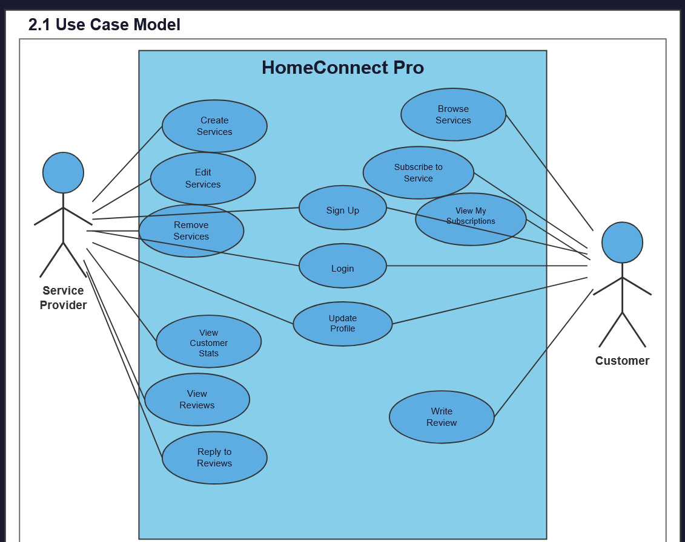

# HomeConnect Pro Hub 

Version 1  
Prepared by Halie Pearson and Braulio Pantoja Esquina
HomeConnect Pro Hub
Oct 21st, 2025

Table of Contents
=================
* [Revision History](#revision-history)
* 1 [Product Overview](#1-product-overview)
* 2 [Use Cases](#2-use-cases)
  * 2.1 [Use Case Model](#21-use-case-model)
  * 2.2 [Use Case Descriptions](#22-use-case-descriptions)
    * 2.2.1 [Actor: Service Provider](#221-actor-service-provider)
    * 2.2.2 [Actor: Customer](#222-actor-customer) 
* 3 [UML Class Diagram](#3-uml-class-diagram)
* 4 [Database Schema](#4-database-schema)

## Revision History
| Name | Date    | Reason For Changes  | Version   |
| ---- | ------- | ------------------- | --------- |
|Halie |10/20    | Initial Design      |    1      |
|      |         |                     |           |
|      |         |                     |           |

## 1. Product Overview
HomeConnect Pro is a comprehensive, user-friendly web application designed to connect customers with trusted home service providers. The platform serves as a centralized marketplace where service providers can showcase their expertise and manage their business, while customers can easily find, subscribe to, and review home services such as plumbing, electrical work, painting, and more.

The application features two distinct user types with tailored dashboards:
- Service Providers can create profiles, list their services with pricing, view customer statistics, and respond to reviews
- Customers can browse available services, subscribe to providers, manage their subscriptions, and write reviews

HomeConnect Pro streamlines the process of finding reliable home service professionals while providing providers with tools to grow their business and maintain customer relationships.

## 2. Use Cases
### 2.1 Use Case Model

### 2.2 Use Case Descriptions

#### 2.2.1 Actor: Service Provider
##### 2.2.1.1 Sign Up

##### 2.2.1.2 Log In

##### 2.2.1.3 Update Provider Profile

##### 2.2.1.4 Create Services

##### 2.2.1.5 Edit Services

##### 2.2.1.6 Remove Services

##### 2.2.1.7 View Customer Statistics

##### 2.2.1.8 View Reviews

##### 2.2.1.9 Reply to Reviews

##### 2.2.1.10 Remove Provider Profile

#### 2.2.2 Actor: Customer
##### 2.2.2.1 Sign Up
A customer can create an account by providing their first name, last name, email address, phone number, physical address, and password. They must agree to Terms of Service and Privacy Policy. Email addresses must be unique in the system.
##### 2.2.2.2 Log In
A customer shall be able to sign in using their registered email, password, and selecting "Customer" as the user type. After successful authentication, the customer is directed to their dashboard displaying a personalized welcome message and quick action cards.
##### 2.2.2.3 Update Customer Profile
A customer shall be able to modify their profile information by navigating to the profile page. They can update their first name, last name, email, phone number, and address.
##### 2.2.2.4 View Available Services 
A customer shall be able to browse all available services from various providers through the services page. Each service displays the service name, description, and hourly rate. Services are presented in an organized card layout for easy browsing.
##### 2.2.2.5 Subscribe to Service 
Upon viewing a service, a customer can subscribe with a one-click "Subscribe" button. The system checks if they're already subscribed to prevent duplicate subscriptions. Upon successful subscription, a confirmation message is displayed and the service is added to their subscriptions list.
##### 2.2.2.6 View My Subscriptions
Customers can view all their active service subscriptions on the subscriptions page. Each subscription displays the service name and includes a quick action button to write a review. If no subscriptions exist, the page displays a helpful message with a link to browse services.
##### 2.2.2.7 Write Review
A customer may write a review for any service they have subscribed to. The system first verifies the customer has active subscriptions. The review process prompts the customer to select which service to review, provide a rating from one to five stars, and write detailed feedback comments. A confirmation message acknowledges successful review submission.

## 3. UML Class Diagram

## 4. Database Schema
